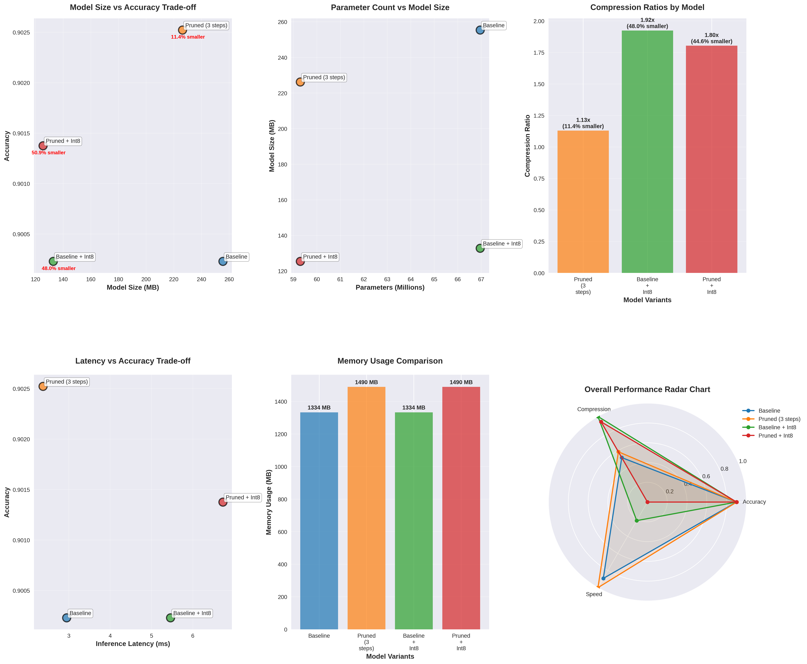

# TinyML: Efficient Transformer Compression  

Exploring **model optimization for efficient inference** on resource-constrained devices (Edge / IoT ML).  

The goal is to **compress transformer-based models (LLMs, BERT-like)** using a combination of **pruning, quantization, and knowledge distillation**, while incorporating **energy-aware optimization** so that inference is feasible on microcontrollers and edge devices.  

---

## Techniques Under Consideration  

### **Pruning**  
- **[Movement Pruning](https://arxiv.org/pdf/2005.07683)**  
  Weights are pruned based on their *movement towards zero* during fine-tuning (more robust than magnitude-only pruning).  
- **[Head Pruning](https://arxiv.org/pdf/1905.10650)**  
  Many attention heads are redundant — greedy removal shows minimal performance drop while reducing compute.  
- **Lottery Ticket Hypothesis ([Chen et al., 2020](https://arxiv.org/pdf/2007.12223))**  
  Transformers contain sparse “winning ticket” subnetworks (up to ~70% sparsity) that can be trained in isolation and retain strong performance.  

---

### **Quantization**  
- Reduce weight/activation precision (e.g. FP32 → INT8/4-bit).  
- Mixed-precision quantization: sensitive layers keep higher precision, others compressed aggressively.  
- Example papers:  
  - **[I-BERT](https://arxiv.org/abs/2101.01321)** – Integer-only quantization with negligible accuracy loss.  
  - **[AWQ](https://arxiv.org/abs/2306.00978)** – Activation-aware weight quantization, effective for LLMs.  

---

### **Knowledge Distillation**  
- Train a compact **student model** to mimic the pruned & quantized **teacher model**.  
- Helps recover accuracy lost from pruning/quantization.  
- Example: **[DistilBERT](https://arxiv.org/abs/1910.01108)** achieves ~97% of BERT performance with 40% fewer parameters.  

---

### **Energy-Aware Optimization**  
- Beyond FLOPs → optimize for **energy per inference**, since memory access can dominate compute cost.  
- Methods:  
  - Profiling transformer layers on edge hardware (e.g., Raspberry Pi, ARM Cortex).  
  - Energy-guided pruning/quantization: keep layers with low *accuracy per Joule* efficiency compressed more.  
  - Potentially combine with **dynamic early-exit** (exit early if confidence high, saving energy).  

---

## Planned Contribution  
1. **Design a pipeline** that first prunes and quantizes a transformer, then distills it into a compact student.  
2. **Introduce energy-aware criteria** into pruning/quantization decisions (optimize for Joules, not just FLOPs).  
3. **Evaluate on real devices** (e.g., Raspberry Pi, microcontrollers) in terms of accuracy, latency, memory, and energy.  

---

## Potential Work  
- Implement baseline compression methods (movement pruning, INT8 quantization).  
- Add distillation step.  
- Profile hardware energy usage → propose energy-aware compression strategy.  
- Benchmark against existing baselines (DistilBERT, TinyBERT, AWQ).  
